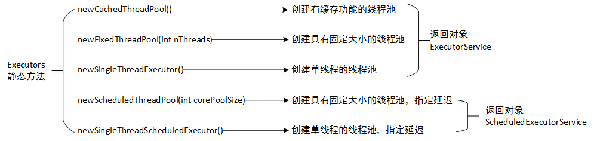
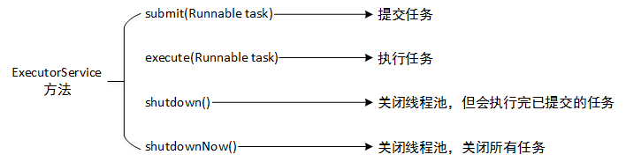

#### 线程池的学习

工作中经常用到线程池，主要是因为一个错误。感觉自己对线程池的认识不足。

```
10-12 12:27:11 [pool-9-thread-4] ERROR xxxxxxxxxxxxxxxxxxxxxxxx - failed to write error trace result to nbfs: unable to create new native thread
java.lang.OutOfMemoryError: unable to create new native thread
        at java.lang.Thread.start0(Native Method)
        at java.lang.Thread.start(Thread.java:714)
        at java.util.concurrent.ThreadPoolExecutor.addWorker(ThreadPoolExecutor.java:950)
        at java.util.concurrent.ThreadPoolExecutor.execute(ThreadPoolExecutor.java:1368)
        at sun.nio.ch.SimpleAsynchronousFileChannelImpl.implWrite(SimpleAsynchronousFileChannelImpl.java:393)
        at sun.nio.ch.AsynchronousFileChannelImpl.write(AsynchronousFileChannelImpl.java:251)
        at com.networkbench.nbfs.io.NBFSWriter.writeTo(NBFSWriter.java:284)
        at com.networkbench.newlens.datacollector.backend.processor.MobileAppErrorTraceMessageHandler.receive(MobileAppErrorTraceMessageHandler.java:150)
        at com.networkbench.newlens.datacollector.backend.processor.MobileAppErrorTraceMessageHandler.receive(MobileAppErrorTraceMessageHandler.java:38)
        at com.networkbench.newlens.datacollector.mq.processor.AvroWrappedMessageConsumer$1.run(AvroWrappedMessageConsumer.java:188)
        at java.util.concurrent.ThreadPoolExecutor.runWorker(ThreadPoolExecutor.java:1142)
        at java.util.concurrent.ThreadPoolExecutor$Worker.run(ThreadPoolExecutor.java:617)
```


**线程池** ： 顾名思义，用一个池子装载多个线程，使用池子去管理多个线程]

**问题来源** ：应用大量通过new Thread()方法创建执行时间短的线程，较大的消耗系统资源并且系统的响应速度变慢。

**解决办法**：使用线程池管理短时间执行完毕的大量线程，通过重用已存在的线程，降低线程创建和销毁造成的消耗，提高系统响应速度。

使用线程池的好处
1. 降低资源消耗。通过重复利用已创建的线程降低线程创建和销毁造成的消耗。
2. 提高响应速度。当任务到达时，任务可以不需要等到线程创建就能立即执行。
3. 提高线程的可管理性。线程是稀缺资源，如果无限制的创建，不仅会消耗系统资源，还会降低系统的稳定性，使用线程池可以进行统一的分配，调优和监控。

##### demo

```
package com.evan.juc.threadpool;

import java.util.concurrent.ExecutorService;
import java.util.concurrent.Executors;
import java.util.concurrent.TimeUnit;

/**
 * @Description
 * @ClassName FixedThreadDemo
 * @Author Evan
 * @date 2020.02.08 18:22
 */
public class FixedThreadDemo {
    public static void main(String[] args) {
        ExecutorService threadPool = Executors.newFixedThreadPool(5);//一池中5个线程
        try {
            for (int i = 0; i < 10; i++) {
                threadPool.execute(() -> {
                    System.out.println(Thread.currentThread().getName() + "\t 执行");
                    try {
                        TimeUnit.SECONDS.sleep(3);
                    } catch (InterruptedException e) {
                        e.printStackTrace();
                    }
                    System.out.println(Thread.currentThread().getName() + "\t 执行完成");

                });
            }
        } finally {
            threadPool.shutdown();
        }
    }
}

```

```
package com.evan.juc.threadpool;

import java.util.concurrent.ExecutorService;
import java.util.concurrent.Executors;
import java.util.concurrent.TimeUnit;

/**
 * @Description
 * @ClassName CachedThreadDemo
 * @Author Evan
 * @date 2020.02.08 18:30
 */
public class CachedThreadDemo {

    public static void main(String[] args) {
        ExecutorService threadPool = Executors.newCachedThreadPool();//一池N个线程


        threadPool.submit(() -> {
            for (int i = 0; i < 100; i++) {
                System.out.println(Thread.currentThread().getName() + ": " + i);
                try {
                    TimeUnit.SECONDS.sleep(3);
                } catch (InterruptedException e) {
                    e.printStackTrace();
                }

            }
        });

        threadPool.submit(() -> {
            for (int i = 0; i < 100; i++) {
                System.out.println(Thread.currentThread().getName() + ": " + i);
                try {
                    TimeUnit.SECONDS.sleep(3);
                } catch (InterruptedException e) {
                    e.printStackTrace();
                }

            }
        });
//        threadPool.shutdown();
        try {
            for (int i = 0; i < 10; i++) {

                threadPool.execute(() -> {
                    System.out.println(Thread.currentThread().getName() + "\t 执行");
                    try {
                        TimeUnit.SECONDS.sleep(3);
                    } catch (InterruptedException e) {
                        e.printStackTrace();
                    }
                    System.out.println(Thread.currentThread().getName() + "\t 执行完成");

                });
            }
        } finally {
            threadPool.shutdown();
        }
    }
}

```


#### 创建线程池


#### 线程池使用方法


```
package com.evan.juc.threadpool;

import java.util.concurrent.*;

/**
 * @Description
 * @ClassName ThreadPoolTest
 * @Author Evan
 * @date 2020.03.16 22:01
 */
public class ThreadPoolTest {

    // 固定大小的线程池：
    // 初始化一个指定线程数的线程池，其中corePoolSize == maximumPoolSize，使用LinkedBlockingQuene作为阻塞队列，当线程池没有可执行任务时，也不会释放线程。
    private static ExecutorService executor = Executors.newFixedThreadPool(10);
    private static ThreadPoolExecutor executor_ = new ThreadPoolExecutor(10, 10,
            0L, TimeUnit.MILLISECONDS, new LinkedBlockingQueue<Runnable>());


    // 缓存线程池：
    // 初始化一个可以缓存线程的线程池，默认缓存60s，线程池的线程数可达到Integer.MAX_VALUE，即2147483647，内部使用SynchronousQueue作为阻塞队列；
    // 和newFixedThreadPool创建的线程池不同，newCachedThreadPool在没有任务执行时，当线程的空闲时间超过keepAliveTime，会自动释放线程资源，当提交新任务时，如果没有空闲线程，则创建新线程执行任务，会导致一定的系统开销；
    // 所以，使用该线程池时，一定要注意控制并发的任务数，否则创建大量的线程可能导致严重的性能问题;
    private static ExecutorService executor2 = Executors.newCachedThreadPool();
    private static ExecutorService executor2_ = new ThreadPoolExecutor(0,
            Integer.MAX_VALUE, 60L, TimeUnit.SECONDS, new SynchronousQueue<Runnable>());


    // 线程池中只有一个线程
    // 初始化的线程池中只有一个线程，如果该线程异常结束，会重新创建一个新的线程继续执行任务，唯一的线程可以保证所提交任务的顺序执行，内部使用LinkedBlockingQueue作为阻塞队列。
    private static ExecutorService executor3 = Executors.newSingleThreadExecutor();
//  因为FinalizableDelegatedExecutorService类是不可直接访问的，这样写会报错，所以注释掉
//  private static ExecutorService executor3_ = new FinalizableDelegatedExecutorService
//            (new ThreadPoolExecutor(1, 1,
//                    0L, TimeUnit.MILLISECONDS,
//                    new LinkedBlockingQueue<Runnable>()));

    //定时任务线程池：
    //初始化的线程池可以在指定的时间内周期性的执行所提交的任务， 。
    private static ScheduledExecutorService executor4 = Executors.newScheduledThreadPool(5);
//  因为new DelayedWorkQueue()这个类是内部类所以这里也不可以直接这样写，这样写是为了了解它的实现本质
//  private static ExecutorService executor4_ = new ThreadPoolExecutor(1, Integer.MAX_VALUE, 0, NANOSECONDS,
//            new DelayedWorkQueue());


    public static void main(String[] args) {
        if (!executor.isShutdown()) {
            executor.execute(new Task());
        }
        Future f = executor.submit(new Task());
        executor_.execute(new Task());
        executor_.getLargestPoolSize();
    }

    static class Task implements Runnable {
        public void run() {
            System.out.println(Thread.currentThread().getName());
        }
    }
}
```


### 自带线程池的各种坑

#### newFixedThreadPool
```
Executors.newFixedThreadPool(10);
```
固定大小的线程池，源码：
```
    public static ExecutorService newFixedThreadPool(int nThreads) {
        return new ThreadPoolExecutor(nThreads, nThreads,
                                      0L, TimeUnit.MILLISECONDS,
                                      new LinkedBlockingQueue<Runnable>());
    }
```
LinkedBlockingQueue的构造方法
```
    public LinkedBlockingQueue() {
        this(Integer.MAX_VALUE);
    }
```

初始化一个指定线程数的线程池，其中corePoolSize == maximumPoolSize，使用LinkedBlockingQuene作为阻塞队列，超时时间为0，当线程池没有可执行任务时，也不会释放线程。

因为队列LinkedBlockingQueue大小为默认的Integer.MAX_VALUE，可以无限的往里面添加任务，直到内存溢出；


#### newCachedThreadPool
```
Executors.newCachedThreadPool();
```
缓存线程池，源码：
```
    public static ExecutorService newCachedThreadPool() {
        return new ThreadPoolExecutor(0, Integer.MAX_VALUE,
                                      60L, TimeUnit.SECONDS,
                                      new SynchronousQueue<Runnable>());
    }
```

初始化一个可以缓存线程的线程池，默认超时时间60s，线程池的最小线程数时0，但是最大线程数为Integer.MAX_VALUE，即2147483647，内部使用SynchronousQueue作为阻塞队列；

因为线程池的最大值了Integer.MAX_VALUE，会导致无限创建线程；所以，使用该线程池时，一定要注意控制并发的任务数，如果短时有大量任务要执行，就会创建大量的线程，导致严重的性能问题（线程上下文切换带来的开销），线程创建占用堆外内存，如果任务对象也不小，它就会使堆外内存和堆内内存其中的一个先耗尽，导致oom;

#### newSingleThreadExecutor
```
Executors.newSingleThreadExecutor()
```
单线程线程池，它的实现


```
    public static ExecutorService newSingleThreadExecutor() {
        return new FinalizableDelegatedExecutorService
            (new ThreadPoolExecutor(1, 1,
                                    0L, TimeUnit.MILLISECONDS,
                                    new LinkedBlockingQueue<Runnable>()));
    }
```
同newFixedThreadPool线程池一样，队列用的是LinkedBlockingQueue，队列大小为默认的Integer.MAX_VALUE，可以无限的往里面添加任务，直到内存溢出；


#### ThreadPoolExecutor 构造函数
```
    public ThreadPoolExecutor(int corePoolSize,
                              int maximumPoolSize,
                              long keepAliveTime,
                              TimeUnit unit,
                              BlockingQueue<Runnable> workQueue) {
        this(corePoolSize, maximumPoolSize, keepAliveTime, unit, workQueue,
             Executors.defaultThreadFactory(), defaultHandler);
    }
```


##### 基础参数
我们先来总结一下线程池的这些参数
执行任务时
1. 如果线程池中线程数量 < core，新建一个线程执行任务；
2. 如果线程池中线程数量 >= core ,则将任务放入任务队列
3. 如果线程池中线程数量 >= core 且 < maxPoolSize，且任务队列满了，则创建新的线程；
4. 如果线程池中线程数量 > core ,当线程空闲时间超过了keepalive时，则会销毁线程；由此可见线程池的队列如果是无界队列，那么设置线程池最大数量是无效的；
5. 如果线程池中的任务队列满了，而且线程数达到了maxPoolSize，并且没有空闲的线程可以执行新的任务，这时候再提交任务就会执行拒绝策略

#### 源码分析java.util.concurrent.ThreadPoolExecutor
这是最常用的一个类，我们建立的线程池大部分都是用它实现的，所以重点来分析下这个类的源码；

##### 构造方法
它的构造方法有很多，但是最终调用的都是下面这个构造方法
```
    public ThreadPoolExecutor(int corePoolSize,
                              int maximumPoolSize,
                              long keepAliveTime,
                              TimeUnit unit,
                              BlockingQueue<Runnable> workQueue,
                              ThreadFactory threadFactory,
                              RejectedExecutionHandler handler) {
        if (corePoolSize < 0 ||
            maximumPoolSize <= 0 ||
            maximumPoolSize < corePoolSize ||
            keepAliveTime < 0)
            throw new IllegalArgumentException();
        if (workQueue == null || threadFactory == null || handler == null)
            throw new NullPointerException();
        this.corePoolSize = corePoolSize;
        this.maximumPoolSize = maximumPoolSize;
        this.workQueue = workQueue;
        this.keepAliveTime = unit.toNanos(keepAliveTime);
        this.threadFactory = threadFactory;
        this.handler = handler;
    }
```

#### 参数说明
- corePoolSize（核心线程池大小）：当提交一个任务到线程池时，线程池会创建一个线程来执行任务，即使其他空闲的基本线程能够执行新任务也会创建线程，等到需要执行的任务数大于线程池基本大小时就不再创建。如果调用了线程池的prestartAllCoreThreads方法，线程池会提前创建并启动所有基本线程。

- maximumPoolSize（线程池最大大小）：线程池允许创建的最大线程数。如果队列满了，并且已创建的线程数小于最大线程数，则线程池会再创建新的线程执行任务。值得注意的是如果使用了无界的任务队列这个参数就没什么效果。

- ThreadFactory：用于设置创建线程的工厂。 默认使用Executors内部类DefaultThreadFactory，可以通过实现ThreadFactory接口，写自己的Factory，通过线程工厂给每个创建出来的线程设置更有意义的名字，Debug和定位问题时非常又帮助；

- keepAliveTime（线程活动保持时间）：线程池的工作线程空闲后，保持存活的时间。所以如果任务很多，并且每个任务执行的时间比较短，可以调大这个时间，提高线程的利用率。

- TimeUnit（线程活动保持时间的单位）：可选的单位有天（DAYS），小时（HOURS），分钟（MINUTES），毫秒(MILLISECONDS)，微秒(MICROSECONDS, 千分之一毫秒)和毫微秒(NANOSECONDS, 千分之一微秒)。

- workQueue（任务队列）：用于保存等待执行的任务的阻塞队列。可以选择以下几个阻塞队列。
    1. ArrayBlockingQueue：是一个基于数组结构的有界阻塞队列，此队列按 FIFO（先进先出）原则对元素进行排序。
    2. LinkedBlockingQueue：一个基于链表结构的阻塞队列，此队列按FIFO （先进先出） 排序元素，吞吐量通常要高于ArrayBlockingQueue。静态工厂方法Executors.newFixedThreadPool()使用了这个队列。
    3. SynchronousQueue：一个不存储元素的阻塞队列。每个插入操作必须等到另一个线程调用移除操作，否则插入操作一直处于阻塞状态，吞吐量通常要高于LinkedBlockingQueue，静态工厂方法Executors.newCachedThreadPool使用了这个队列。
    4. PriorityBlockingQueue：一个具有优先级的无限阻塞队列。

- RejectedExecutionHandler（拒绝策略）：当队列和线程池都满了，说明线程池处于饱和状态，那么必须采取一种策略处理提交的新任务。

> 这个策略默认情况下是AbortPolicy，表示无法处理新任务时抛出异常。以下是提供的四种策略。
> 1. AbortPolicy：直接抛出异常。默认策略
> 2. CallerRunsPolicy：用调用者所在线程来运行任务。
> 3. DiscardOldestPolicy：丢弃队列里最近的一个任务，并执行当前任务。
> 4. DiscardPolicy：不处理，丢弃掉。
> 
> 当然也可以根据应用场景需要来实现RejectedExecutionHandler接口自定义策略。如记录日志或持久化不能处理的任务。

--- 

#### 重要的成员变量

先看下重要的成员变量ctl及其相关常量

##### ctl
它记录了当前线程池的运行状态和线程池内的线程数；一个变量是怎么记录两个值的呢？它是一个AtomicInteger 类型，有32个字节，这个32个字节中，高3位用来标识线程池的运行状态，低29位用来标识线程池内当前存在的线程数；

```
//利用低29位表示线程池中线程数，通过高3位表示线程池的运行状态：
private final AtomicInteger ctl = new AtomicInteger(ctlOf(RUNNING, 0));
```

##### 线程池状态
线程池有5种状态，这五种状态由五个静态常量标识，每种状态的值的大小
```
RUNNING < shutdown < stop < tidying < terminated;

//32-3 = 29 ，低位29位存储线程池中线程数
private static final int COUNT_BITS = Integer.SIZE - 3;   
//线程池最多可以有536870911个线程，一般绝对创建不到这么大
private static final int CAPACITY   = (1 << COUNT_BITS) - 1;

//RUNNING线程池能接受新任务（只有running状态才会接收新任务），并且可以运行队列中的任务
//-1的二进制为32个1，移位后为：11100000000000000000000000000000
private static final int RUNNING = -1 << COUNT_BITS;

//SHUTDOWN不再接受新任务，但仍可以执行队列中的任务
//0的二进制为32个0，移位后还是全0
private static final int SHUTDOWN = 0 << COUNT_BITS;

//STOP不再接受新任务，不再执行队列中的任务，而且要中断正在处理的任务
//1的二进制为前面31个0，最后一个1，移位后为：00100000000000000000000000000000
private static final int STOP = 1 << COUNT_BITS;

//TIDYING所有任务均已终止，workerCount的值为0，转到TIDYING状态的线程即将要执行terminated()钩子方法.
//2的二进制为01000000000000000000000000000000
private static final int TIDYING = 2 << COUNT_BITS;

//TERMINATED terminated()方法执行结束.
//3移位后01100000000000000000000000000000
private static final int TERMINATED = 3 << COUNT_BITS;
```

###### 要牢记以下几点：
- 只有RUNNING状态下才会接收新任务；
- 只有RUNNING状态和SHUTDOWN状态才会执行任务队列中的任务；
- 其它状态都不会接收新任务，不会执行任务队列中的任务；


#### 状态之间转换关系如下
```
RUNNING -> SHUTDOWN
调用了shutdown方法，线程池实现了finalize方法，在里面调用了shutdown方法，因此shutdown可能是在finalize中被隐式调用的
(RUNNING or SHUTDOWN) -> STOP
调用了shutdownNow方法
SHUTDOWN -> TIDYING
当队列和线程池均为空的时候
STOP -> TIDYING
当线程池为空的时候
TIDYING -> TERMINATED
处于TIDYING状态后最终会进入TERMINATED状态

```
#### 与ctl相关的三个方法
```
//获取线程池的状态,也就是将ctl低29位都置为0后的值
private static int runStateOf(int c)     { return c & ~CAPACITY; } 
//获取线程池中线程数，也就是ctl低29位的值
private static int workerCountOf(int c)  { return c & CAPACITY; }  
//设置ctl的值，rs为线程池状态，wc为线程数；
private static int ctlOf(int rs, int wc) { return rs | wc; }       
```
##### workers
用来存储线程池中的线程，线程都被封装成了Worker对象
```
private final HashSet<Worker> workers = new HashSet<Worker>();
```
##### completedTaskCount
```
//记录了已经销毁的线程，完成的任务总数；
private long completedTaskCount;
```

---

## 线程池的运行

#### 添加任务execute方法
线程池是调用该方法来添加任务的，所以我们就从这个方法看起；
它传入的参数为实现了Runnable接口的对象，要执行的任务写在它的run方法中；

```
    //添加新任务
    public void execute(Runnable command) {
        //如果任务为null直接抛出异常
        if (command == null)
            throw new NullPointerException();
        /*
         * Proceed in 3 steps:
         *
         * 1. If fewer than corePoolSize threads are running, try to
         * start a new thread with the given command as its first
         * task.  The call to addWorker atomically checks runState and
         * workerCount, and so prevents false alarms that would add
         * threads when it shouldn't, by returning false.
         *
         * 2. If a task can be successfully queued, then we still need
         * to double-check whether we should have added a thread
         * (because existing ones died since last checking) or that
         * the pool shut down since entry into this method. So we
         * recheck state and if necessary roll back the enqueuing if
         * stopped, or start a new thread if there are none.
         *
         * 3. If we cannot queue task, then we try to add a new
         * thread.  If it fails, we know we are shut down or saturated
         * and so reject the task.
         */


        //获取当前线程池的ctl值，不知道它作用的看前面说明
        int c = ctl.get();

        //如果当前线程数小于核心线程数，这时候任务不会进入任务队列，会创建新的工作线程直接执行任务；
        if (workerCountOf(c) < corePoolSize) { 
            //添加新的工作线程执行任务，addWorker方法后面分析
            if (addWorker(command, true))
                return;
            //addWorker操作返回false，说明添加新的工作线程失败，则获取当前线程池状态；（线程池数量小于corePoolSize情况下，创建新的工作线程失败，是因为线程池的状态发生了改变，已经处于非Running状态，或shutdown状态且任务队列为空）
            c = ctl.get();
        }

        //以下两种情况继续执行后面代码
        //1.前面的判断中，线程池中线程数小于核心线程数，并且创建新的工作线程失败；
        //2.前面的判断中，线程池中线程数大于等于核心线程数

        //线程池处于RUNNING状态，说明线程池中线程已经>=corePoolSize,这时候要将任务放入队列中，等待执行;
        if (isRunning(c) && workQueue.offer(command)) {
            int recheck = ctl.get();
            //再次检查线程池的状态，如果线程池状态变了，非RUNNING状态下不会接收新的任务，需要将任务移除，成功从队列中删除任务，则执行reject方法处理任务；
            if (! isRunning(recheck) && remove(command))
                reject(command);

            //如果线程池的状态没有改变，且池中无线程
            // 两种情况进入以该分支
            //1.线程池处于RUNNING状态，线程池中没有线程了，因为有新任务进入队列所以要创建工作线程（这时候新任务已经在队列中，所以下面创建worker线程时第一个参数，要执行的任务为null，只是创建一个新的工作线程并启动它，让它自己去队列中取任务执行）
            //2.线程池处于非RUNNING状态但是任务移除失败,导致任务队列中仍然有任务，但是线程池中的线程数为0，则创建新的工作线程，处理队列中的任务；
            else if (workerCountOf(recheck) == 0)
                addWorker(null, false);

        // 两种情况执行下面分支：
        // 1.非RUNNING状态拒绝新的任务,并且无法创建新的线程，则拒绝任务
        // 2.线程池处于RUNNING状态，线程池线程数量已经大于等于coresize，任务就需要放入队列，如果任务入队失败，说明队列满了，则创建新的线程，创建成功则新线程继续执行任务，如果创建失败说明线程池中线程数已经超过maximumPoolSize，则拒绝任务
        }else if (!addWorker(command, false))
            reject(command);
    }
```

##### 往线程池添加线程addWorker方法
往线程池中添加工作线程，线程会被封装成Worker对象，放入到works线程池中

它的执行过程如下：
- 增加线程时，先判断当前线程池的状态允不允许创建新的线程，如果允许再判断线程池有没有达到 限制，如果条件都满足，才继续执行；
- 先增加线程数计数ctl，增加计数成功后，才会去创建线程;
- 创建线程是通过work对象来创建的，创建成功后，将work对象放入到works线程池中（就是一个hashSet）;
- 添加完成后，更新largestPoolSize值（线程池中创建过的线程最大数量），最后启动线程，如果参数firstTask不为null，则执行第一个要执行的任务，然后循环去任务队列中取任务来执行；
---

##### 成功添加worker工作线程需要线程池处于以下两种状态中的一种
1. 线程池处于RUNNING状态
2. 线程池处于SHUTDOWN状态，且创建线程的时候没有传入新的任务（此状态下不接收新任务），且任务队列不为空（此状态下，要执行完任务队列中的剩余任务才能关闭）；

---

```
private boolean addWorker(Runnable firstTask, boolean core) {
    // 以下for循环，增加线程数计数，ctl，只增加计数，不增加线程，只有增加计数成功，才会增加线程
    retry:
    for (;;) {
        int c = ctl.get();
        int rs = runStateOf(c);
        //这个代码块的判断，如果是STOP，TIDYING和TERMINATED这三种状态，都会返回false。(这几种状态不会接收新任务，也不再执行队列中的任务，中断当前执行的任务)
        //如果是SHUTDOWN，firstTask不为空（SHUTDOWN状态下，不会接收新任务）或 者workQueue是空（队列里面都没有任务了，也就不需要线程了），返回false。
        if (rs >= SHUTDOWN &&
            ! (rs == SHUTDOWN &&
               firstTask == null &&
               ! workQueue.isEmpty()))
            return false;
        //只有满足以下两种条件才会继续创建worker线程对象
        //1.RUNNING状态，
        //2.shutdown状态，且firstTask为null（因为shutdown状态下不再接收新任务），队列不是空（shutdown状态下需要继续处理队列中的任务）
         通过自旋的方式增加线程池线程数
        for (;;) {
            int wc = workerCountOf(c);
            //1.如果线程数大于最大可创建的线程数CAPACITY，直接返回false；
            //2.判断当前是要根据corePoolSize，还是maximumPoolSize进行创建线程（corePoolSize是基本线程池大小，未达到corePoolSize前按照corePollSize来限制线程池大小,达到corePoolSize后，并且任务队列也满了，才会按照maximumPoolSize限制线程池大小）
            if (wc >= CAPACITY ||
                wc >= (core ? corePoolSize : maximumPoolSize))
                return false;
            if (compareAndIncrementWorkerCount(c))//将WorkerCount通过CAS操作增加1，成功的话直接跳出两层循环；
                break retry;
            c = ctl.get();  // Re-read ctl
            if (runStateOf(c) != rs)//否则则判断当前线程池的状态，如果现在获取到的状态与进入自旋的状态不一致的话，那么则通过continue retry重新进行状态的判断
                continue retry;
            // else CAS failed due to workerCount change; retry inner loop
        }
    }

    //以下代码块是创建Worker线程对象，并启动

    boolean workerStarted = false;
    boolean workerAdded = false;
    Worker w = null;
    try {
        w = new Worker(firstTask); //创建一个新的Worker对象
        final Thread t = w.thread;
        if (t != null) {
            final ReentrantLock mainLock = this.mainLock;
            mainLock.lock(); //获取线程池的重入锁后，
            try {
                // Recheck while holding lock.
                // Back out on ThreadFactory failure or if
                // shut down before lock acquired.
                int rs = runStateOf(ctl.get());

                // RUNNING状态 || SHUTDOWN状态下，没有新的任务，只是处理任务队列中剩余的任务；
                if (rs < SHUTDOWN ||
                    (rs == SHUTDOWN && firstTask == null)) {
                    //如果线程是活动状态，直接抛出异常，因为线程刚创建，还没有执行start方法，一定不会是活动状态； 
                    if (t.isAlive())
                        throw new IllegalThreadStateException();
                    // 将新启动的线程添加到线程池中
                    workers.add(w); 
                    // 更新largestPoolSize的值，largestPoolSize成员变量保存线程池中创建过的线程最大数量
                    int s = workers.size();
                    //将线程池中创建过的线程最大数量，设置给largestPoolSize，可以通过getLargestPoolSize()方法获取，注意这个方法只能在 ThreadPoolExecutor中调用，Executer，ExecuterService，AbstractExecutorService中都是没有这个方法的
                    if (s > largestPoolSize)
                        largestPoolSize = s;
                    workerAdded = true;
                }
            } finally {
                mainLock.unlock();
            }
            // 启动新添加的线程，这个线程首先执行firstTask，然后不停的从队列中取任务执行
            // 当等待keepAlieTime还没有任务执行则该线程结束。见runWoker和getTask方法的代码。
            if (workerAdded) {
                t.start();
                workerStarted = true;
            }
        }
    }finally {
        if (! workerStarted)
            addWorkerFailed(w);
        }
        return workerStarted;
    }
}
```

---
## retry

这retry就是一个标记，标记对一个循环方法的操作（continue和break）处理点，功能类似于goto，所以retry一般都是伴随着for循环出现，retry:标记的下一行就是for循环，在for循环里面调用continue（或者break）再紧接着retry标记时，就表示从这个地方开始执行continue（或者break）操作

---


## 内部类Worker
它是ThreadPoolExecutor的一个内部类
```
private final class Worker
        extends AbstractQueuedSynchronizer
        implements Runnable
    {
        /**
         * This class will never be serialized, but we provide a
         * serialVersionUID to suppress a javac warning.
         */
        private static final long serialVersionUID = 6138294804551838833L;

        /** Thread this worker is running in.  Null if factory fails. */
        final Thread thread;
        /** Initial task to run.  Possibly null. */
        Runnable firstTask;
        /** Per-thread task counter */
        volatile long completedTasks;

        /**
         * Creates with given first task and thread from ThreadFactory.
         * @param firstTask the first task (null if none)
         */
        Worker(Runnable firstTask) {
            setState(-1); // inhibit interrupts until runWorker
            this.firstTask = firstTask;
            this.thread = getThreadFactory().newThread(this);
        }

        /** Delegates main run loop to outer runWorker  */
        public void run() {
            runWorker(this);
        }

        // Lock methods
        //
        // The value 0 represents the unlocked state.
        // The value 1 represents the locked state.

        protected boolean isHeldExclusively() {
            return getState() != 0;
        }

        protected boolean tryAcquire(int unused) {
            if (compareAndSetState(0, 1)) {
                setExclusiveOwnerThread(Thread.currentThread());
                return true;
            }
            return false;
        }

        protected boolean tryRelease(int unused) {
            setExclusiveOwnerThread(null);
            setState(0);
            return true;
        }

        public void lock()        { acquire(1); }
        public boolean tryLock()  { return tryAcquire(1); }
        public void unlock()      { release(1); }
        public boolean isLocked() { return isHeldExclusively(); }

        void interruptIfStarted() {
            Thread t;
            if (getState() >= 0 && (t = thread) != null && !t.isInterrupted()) {
                try {
                    t.interrupt();
                } catch (SecurityException ignore) {
                }
            }
        }
    }
```
由它的定义可以知它实现了Runnable接口，是一个线程，还继承了AQS类，实现了加锁机制；

它利用AQS框架实现了一个简单的非重入的互斥锁， 实现互斥锁主要目的是为了中断的时候判断线程是在空闲还是运行，它的state只有三个值 ，初始状态为不可加锁状态-1，无锁状态为0，加锁状态为1，可以看shutdown、shutdownNow、runWorker方法来分析它锁的作用。

##### Worker的构造方法
构造方法里面要重点关注一下getThreadFactory()这个方法
```
        //参数为Worker线程运行后第一个要执行的任务
        Worker(Runnable firstTask) { 
            //设置ASQ的state为-1  设置worker处于不可加锁的状态，看后面的tryAcquire方法，只有state为0时才允许加锁，worker线程运行以后才会把state置为0
            setState(-1); 
            //设置第一个运行的任务
            this.firstTask = firstTask;  
            //创建线程，将this自己传入进去；getThreadFactory()见后面详解
            this.thread = getThreadFactory().newThread(this); 
        }
```

##### 线程的创建getThreadFactory()；
默认会在构造方法中传入Executors.defaultThreadFactory()，该方法 new 一个 DefaultThreadFactory();
```
public static ThreadFactory defaultThreadFactory() {
        return new DefaultThreadFactory();
}
```
```
 static class DefaultThreadFactory implements ThreadFactory {
        //线程池编号
        private static final AtomicInteger poolNumber = new AtomicInteger(1);
        //线程池中线程所属线程组
        private final ThreadGroup group;
        //线程池中线程编号
        private final AtomicInteger threadNumber = new AtomicInteger(1);
        //线程名称前缀
        private final String namePrefix;

        DefaultThreadFactory() {
            SecurityManager s = System.getSecurityManager();
            group = (s != null) ? s.getThreadGroup() :
                                  Thread.currentThread().getThreadGroup();
            //设置线程名称为"pool-线程池的编号-thread-线程的编号"
            namePrefix = "pool-" +
                          poolNumber.getAndIncrement() +
                         "-thread-";
        }

        //创建新的线程
        public Thread newThread(Runnable r) {
            Thread t = new Thread(group, r,
                                  namePrefix + threadNumber.getAndIncrement(),
                                  0);
            //设置为非守护线程
            if (t.isDaemon())
                t.setDaemon(false);
            //设置优先级为NORMAL为5
            if (t.getPriority() != Thread.NORM_PRIORITY)
                t.setPriority(Thread.NORM_PRIORITY);
            return t;
        }
    }
```

一般我们最好不要用默认的线程池，可以继承该类，给线程指定一个识别度高的名字，出了问题好排查；
 
 #### demo
 
 ```
 
 ```
 

##### Worker的成员变量
```
 //被封装的线程，就是它自己；
 final Thread thread;
 //传入的它要执行的第一个任务，如果firstTask为空就从任务队列中取任务执行
 Runnable firstTask;
 //记录执行完成的任务数量，如果执行任务过程中出现异常，仍然会计数；
 volatile long completedTasks
 ```

##### worker线程的加锁解锁
worker的加锁解锁机制是基于AQS框架的，要完全弄明白它的加锁解锁机制请看AQS框架的实现，在这里只是简单介绍一下：
```
//尝试加锁方法，将状态从0设置为1；如果不是0则加锁失败,在worker线程没有启动前是-1状态，无法加锁
//该方法重写了父类AQS的同名方法
protected boolean tryAcquire(int unused) {
    if (compareAndSetState(0, 1)) {
        setExclusiveOwnerThread(Thread.currentThread());
        return true;
    }
    return false;
}

//尝试释放锁的方法，直接将state置为0
//该方法重写了父类AQS的同名方法
protected boolean tryRelease(int unused) {
    setExclusiveOwnerThread(null);
    setState(0);
    return true;
}
//注意：tryAcquire与tryRelease是重写了AQS父类的方法，且不可以直接调用，它们被以下方法调用实现加锁解锁操作

//加锁:acquire法是它父类AQS类的方法,会调用tryAcquire方法加锁
public void lock()        { acquire(1); }
//尝试加锁
public boolean tryLock()  { return tryAcquire(1); }
//解锁:release方法是它父类AQS类的方法，会调用tryRelease方法
public void unlock()      { release(1); }
//返回锁状态
public boolean isLocked() { return isHeldExclusively(); }

```

##### Worker线程执行任务runWorker （重要）
看完了Worker线程的创建，再来看看Worker线程的运行，Worker的run方法中会调用runWorker方法来获循环取任务并执行；
```
final void runWorker(Worker w) {
    // 当前线程
    Thread wt = Thread.currentThread();
    // 获取当前Worker线程创建时，指定的第一个要执行的任务，也可以不指定任务，那么它自己就会去任务队列中取任务；
    Runnable task = w.firstTask;
    w.firstTask = null;
    // 在构造方法里面将state设置为了-1，执行该方法就将state置为了0，这样就可以加锁了，-1状态下是无法加锁的，看Worker类的tryAcquire方法
    w.unlock(); 
    //该变量代表任务执行是否发生异常，默认值为true发生了异常，后面会用到这个变量
    boolean completedAbruptly = true;
    try {
        /**
        * 如果创建worker时传入了第一个任务，则执行第一个任务，否则
        * 从任务队列中获取任务getTask()，getTask()后面分析；
        */
        while (task != null || (task = getTask()) != null) { 
            // 线程加锁
            w.lock();
            /**
             * 先判断线程池状态是否允许继续执行任务：
             * 1.如果是stop<tidying<terminated（这种状态是不接受任务，且不执行任务的），并且线程是非中断状态
             * 2.shutingdown，runing ，处于中断状态（并复位中断标志），如果这个时候其它线程执行了shutdownNow方法，shutdownNow方法会把状态设置为STOP
             * 
             * 这个时候则中断线程
             **/
            if ((   
                    runStateAtLeast(ctl.get(), STOP) || 
                    (
                        Thread.interrupted() && runStateAtLeast(ctl.get(), STOP) 
                    ) 

                ) 
                 &&
                !wt.isInterrupted())
                wt.interrupt();

            /**
             * 开始执行任务
             */
            try {
                //任务执行前要做的处理：这个方法是空的，什么都不做，一般会通过继承ThreadPoolExecute类后重写该方法实现自己的功能；传入参数为当前线程与要执行的任务
                beforeExecute(wt, task);
                Throwable thrown = null;
                try {
                    task.run();
                } catch (RuntimeException x) {
                    thrown = x; throw x;
                } catch (Error x) {
                    thrown = x; throw x;
                } catch (Throwable x) {
                    thrown = x; throw new Error(x);
                } finally {
                    // 任务执行后要做的处理：这个方法也是空的，什么都不做,一般会通过继承ThreadPoolExecute类后重写该方法实现自己的功能；参数为当前任务和执行任务时抛出的异常
                    afterExecute(task, thrown); 
                }
            } finally {
                task = null;
                //增加完成任务计数
                w.completedTasks++;   
                w.unlock();
            }
        }

        /**
         *退出while循环，线程结束；
         **/
        //判断task.run()方法是否抛出了异常，如果没有则设置它为false，如果发生了异常，前面会直接抛出，中断方法继续执行，就不会执行下面这句；
        completedAbruptly = false;
    } finally {
    
        /**
         * 线程退出后的处理
         */
        processWorkerExit(w, completedAbruptly);
    }
}
```

需要注意的是，线程如果执行任务过程中，业务代码抛出了异常，那么会将抛出的异常catch以后抛出，如果是Throwable类型的异常，则会封装成Error抛出，最后此线程退出，但是退出之前会将任务完成数照样+1，然后会在控制台上打印Error或者是RuntimeException 异常，这些异常不会被我们捕获，异常信息只会在控制台打出，不会再我们的log日志中打出；
所以我们一定要自己去捕获并处理我们的异常，而不能抛出不管；

##### worker线程从任务队列里面获取任务getTask
从任务队列中获取任务

```
这是个for循环
1.先判断线程池状态是否允许取任务，不允许直接将线程数量减1 ，直接返回null；
2.若线程池状态允许取任务，则判断当前线程是否超时 ，若线程超时则将线程池数量减1，直接返回null；
3.若没有超时，则去任务队列取任务，取到的话返回任务，若超时则设置超时状态，继续循环，在下次循环中处理超时状态
```

```
     private Runnable getTask() {
        // 如果判断当前线程池状态需要启用超时操作，那么任务队列取任务时使用的是带有超时的workQueue.poll(keepAliveTime, TimeUnit.NANOSECONDS)方法，如果超时，则会将timeOut 变量设置为true，在下次执行for循环时根据timeOut来执行超时操作；
        boolean timedOut = false;  

        for (;;) {
            int c = ctl.get();
            int rs = runStateOf(c);
            /**
            * 以下分支在stop、tidying、terminated状态，或者在SHUTDOWN状态且任务队列为空时　退出当前线程
            * 
            * 判断线程池状态是否允许继续获取任务：
            * RUNNING<shutdown<stop<tidying<terminated;
            * rs >= SHUTDOWN，包含两部分判断操作
            *1.如果是rs > SHUTDOWN，即状态为stop、tidying、terminated；这时不再处理队列中的任务，直接返回null
            *2.如果是rs = SHUTDOWN ，rs>=STOP不成立，这时还需要处理队列中的任务除非队列为空，没有任务要处理，则返回null
            */
            // Check if queue empty only if necessary.
            if (rs >= SHUTDOWN && (rs >= STOP || workQueue.isEmpty())) {
                //自旋锁将ctl减1（也就是将线程池中的线程数减1）
                decrementWorkerCount();
                return null;
            }
            /**
             * 在RUNNING状态 或 shutdown状态且任务队列不为空时继续往下执行执行
             */

            /**
             *　以下做线程超时控制：
             * 启用超时控制需要满足至少一个条件
             * 1.allowCoreThreadTimeOut为true代表核心线程数可以做超时控制；
             * 2.如果当前线程数>corePoolSize核心线程数,也可以做超时控制；
             * 在以上前提下，再判断当前线程是否需要销毁:
             * 1.如果当前线程数大于maximumPoolSize，这肯定是不允许的，需要销毁当前线程；
             * 2.如果当前线程上次执行循环时，取任务操作超时，任务队列是空，需要销毁当前线程；
             */

            //获取线程池中线程数量
            int wc = workerCountOf(c);

            // timed变量用于判断是否需要进行超时控制。
            // allowCoreThreadTimeOut默认是false，也就是核心线程不允许进行超时；
            // wc > corePoolSize，表示当前线程池中的线程数量大于核心线程数量；
            // 对于超过核心线程数量的这些线程，需要进行超时控制； 
            boolean timed = allowCoreThreadTimeOut || wc > corePoolSize;

            /*
            * 超时销毁线程需要先满足以下两个条件之一
            * 1. wc > maximumPoolSize的情况是因为可能在此方法执行阶段同时执行了setMaximumPoolSize方法；
            * 2. timed && timedOut 如果为true，表示当前操作需要进行超时控制，并且上次循环当前线程从任务队列中获取任务发生了超时，没有取到任务；
            *  满足上面两个条件之一的情况下，接下来判断，如果线程数量大于1，或者线程队列是空的，那么尝试将workerCount减1，减1成功则返回null，退出当前线程； 如果减1失败，则返回继续执行循环操作，重试。
            */
            if ((wc > maximumPoolSize || (timed && timedOut))
                && (wc > 1 || workQueue.isEmpty())) {
                //尝试将线程池线程数量减一
                if (compareAndDecrementWorkerCount(c))
                    return null;
                //如果将线程池数量减一不成功则循环重试
                continue;
            }


            /**
             * 如果没有超时，则继续去任务队列取任务执行；
             *取任务操作
             */
            try {
                //根据timed（是否启用超时控制）来判断执行poll操作还是执行take()操作还是执行有时间限制的poll操作，并返回获取到的任务；
                Runnable r = timed ?
                    workQueue.poll(keepAliveTime, TimeUnit.NANOSECONDS) :
                    workQueue.take(); 
                if (r != null)
                    return r;
                //如果poll操作等待超时,没有取到任务；则将timeOut设置为true；
                timedOut = true;
            } catch (InterruptedException retry) {
                //如果是因为线程中断导致没有取到任务；则设置timedOut=false继续执行循环，取任务
                timedOut = false;
            }
        }
    }
```

#### Worker线程的退出processWorkerExit
如果是处理任务发生异常导致的退出，则以自旋锁的方式将线程数减1； 

将当前worker执行完成的任务数，累加到completedTaskCount上；

将当前线程移出线程池；

尝试终止线程池；


###### 判断是否要新建workder线程；
1. 如果是RUNNING或SHUTDOWN状态，且worker是异常结束，会直接执行AddWorker操作；
2. 如果是RUNNING或SHUTDOWN状态，且worker是没有任务可做结束的，且allowCoreThreadTimeOut=false，且当前线程池中的线程数小于corePoolSize，则会创建addWorker线程；
3. 判断是否要添加一个新的线程：线程池是RUNNING或SHUTDOWN状态，worker线程如果是异常结束的，则直接添加一个新线程；如果当前线程池中的线程数小于最小线程数，也会创建一个新线程；
```
 private void processWorkerExit(Worker w, boolean completedAbruptly) {
         // 如果任务运行异常导致则completedAbruptly=true，则将线程池worker线程数减1，如果是没有获取到任务导致的completedAbruptly=false，则会在getTask()方法里面将线程数减1;
        if (completedAbruptly) 
            //自旋锁将ctl减1（也就是将线程池中的线程数减1）
            decrementWorkerCount(); 

        final ReentrantLock mainLock = this.mainLock;
        mainLock.lock();
        try {
            //退出前，将本线程已完成的任务数量，添加到已经完成任务的总数中；
            completedTaskCount += w.completedTasks;
            //线程队列中移除当前线程 
            workers.remove(w);
        } finally {
            mainLock.unlock();
        }

        //尝试停止线程池
        tryTerminate();

       /**
        *判断是否要增加新的线程
        *如果满足以下条件则新增线程：
        * 一、当线程池是RUNNING或SHUTDOWN状态，且worker是异常结束，那么会直接addWorker；
        * 二、当线程池是RUNNING或SHUTDOWN状态，且worker是没有任务可做结束的；
        *   1.如果allowCoreThreadTimeOut=true，则判断等待队列不为空  ，且当前线程数是否小于1；
        *   2.如果allowCoreThreadTimeOut=false，则判断当前线程数是否小于小于corePoolSize；
        *   如果小于，则会创建addWorker线程；
        **/
        int c = ctl.get();
        //当线程池是RUNNING或SHUTDOWN状态，
        if (runStateLessThan(c, STOP)) {
            //如果非异常状况completedAbruptly=false，也就是没有获取到可执行的任务，则获取线程池允许的最小线程数，如果allowCoreThreadTimeOut为true说明允许核心线程超时，则最小线程数为0，否则最小线程数为corePoolSize;
            if (!completedAbruptly) {
                int min = allowCoreThreadTimeOut ? 0 : corePoolSize;
                //如果allowCoreThreadTimeOut=true，且任务队列有任务要执行，则将最最小线程数设置为1
                if (min == 0 && ! workQueue.isEmpty())
                    min = 1;
                //如果当前线程数大于等于最小线程数，则直接返回
                if (workerCountOf(c) >= min)
                    return; // replacement not needed
            }
            //以下两种情况会添加一个新的线程
            //1.worker是异常结束；
            //2.如果是非异常结束，且任务队列里面还有任务，
            addWorker(null, false);
        }
    }
        //当线程池是RUNNING或SHUTDOWN状态，
```

#### 线程池的关闭
线程池的关闭有两个方法shutdown() 与shutdownNow() ；

shutdown会将线程池状态设置为SHUTDOWN状态，然后中断所有空闲线程，然后执行tryTerminate()方法（tryTerminate这个方法很重要，会在后面分析），来尝试终止线程池;

shutdownNow会将线程池状态设置为STOP状态，然后中断所有线程（不管有没有执行任务都设置为中断状态），然后执行tryTerminate()方法，来尝试终止线程池;
```
public void shutdown() {
        final ReentrantLock mainLock = this.mainLock;
        mainLock.lock();
        try {
            checkShutdownAccess();
            // 线程池状态设为SHUTDOWN，如果已经是shutdown<stop<tidying<terminated，也就是非RUNING状态则直接返回 
            advanceRunState(SHUTDOWN);
            // 中断空闲的没有执行任务的线程
            interruptIdleWorkers();
            onShutdown(); //空方法，子类覆盖实现
        } finally {
            mainLock.unlock();
        }
        tryTerminate();
    }

    public List<Runnable> shutdownNow() {
        List<Runnable> tasks;
        final ReentrantLock mainLock = this.mainLock;
        mainLock.lock();
        try {
            checkShutdownAccess();
            // STOP状态：不再接受新任务且不再执行队列中的任务。
            advanceRunState(STOP);
            // 中断所有线程，无论空闲还是在执行任务
            interruptWorkers();
            // 将任务队列清空，并返回队列中还没有被执行的任务。
            tasks = drainQueue();
        }finally {
            mainLock.unlock();
        }
        tryTerminate();
        return tasks;
    }

```
这两个方法可以直接调用，来关闭线程池；shutdown方法还会在线程池被垃圾回收时调用,因为ThreadPoolExecuter重写了finalize方法
```
  protected void finalize() {
        shutdown();
  }

```
关于finalize方法说明：
垃圾回收时，如果判断对象不可达，且覆盖了finalize方法，则会将对象放入到F-Queue队列 ，有一个名为”Finalizer”的守护线程执行finalize方法，它的优先级为8，做最后的清理工作，执行finalize方法完毕后，GC会再次判断该对象是否可达，若不可达，则进行回收，否则，对象复活
注意：网上很多人说 ，Finalizer线程的优先级低，个人认为这是不对的，Finalizer线程在jdk1.8的优先级是8，比我们创建线程默认优先级5要高，之前其它版本的jdk我记得导出的线程栈信息里面优先级是5，忘记是哪个版本的jdk了，即使是5优先级也不比自建的线程默认优先级低，总之我没见过优先级低于5的Finalizer线程；

这个线程会不停的循环等待java.lang.ref.Finalizer.ReferenceQueue中的新增对象。一旦Finalizer线程发现队列中出现了新的对象，它会弹出该对象，调用它的finalize()方法，将该引用从Finalizer类中移除，因此下次GC再执行的时候，这个Finalizer实例以及它引用的那个对象就可以回垃圾回收掉了。

大多数时候，Finalizer线程能够赶在下次GC带来更多的Finalizer对象前清空这个队列,但是当它的处理速度没法赶上新对象创建的速度，对象创建的速度要比Finalizer线程调用finalize()结束它们的速度要快，这导致最后堆中所有可用的空间都被耗尽了;
当我们大量线程频繁创建重写了finalizer（）方法的对象的情况下，高并发情况下，它可能会导致你内存的溢出；虽然Finalizer线程优先级高，但是毕竟它只有一个线程；最典型的例子就是数据库连接池,proxool，对要释放资源的操作加了锁，并在finalized方法中调用该加锁方法，在高并发情况下，锁竞争严重，finalized竞争到锁的几率减少，finalized无法立即释放资源，越来越多的对象finalized()方法无法被执行，资源无法被回收，最终导致导致oom；所以覆盖finalized方法，执行一定要快，不能有锁竞争的操作，否则在高并发下死的很惨；


（proxool使用了cglib，它用WrappedConnection代理实际的Conneciton。在运行WrappedConnection的方法时，包括其finalize方法，都会调用Conneciton.isClosed()方法去判断是否真的需要执行某些操作。不幸的是JDBC中的这个方法是同步的，锁是连接对象本身。于是， Finalizer线程回收刚执行过的WrappedConnection对象时就总会与还在使用Connection的各个工作线程争用锁。）

#### 线程池中线程的中断
###### 线程池的中断也有两个方法
- interruptIdleWorkers 中断没有执行任务的线程；
- interruptWorkers 中断所有线程，不管线程有没有执行任务；
```
   //中断空闲线程，没有执行任务的线程会被中断，onlyOne参数用来标识是否只中断一个线程；
   private void interruptIdleWorkers(boolean onlyOne) {
        final ReentrantLock mainLock = this.mainLock;
        mainLock.lock();
        try {
            //遍历所有的Worker线程
            for (Worker w : workers) {
                Thread t = w.thread;
                //如果线程没有被中断，w.tryLock()会调用tryAcquire()方法尝试加锁，加锁成功后会中断线程
                //为什么要w.tryLock(),因为在runWorker()方法的while循环执行任务之前会加锁，如果已经被加锁说明线程正在执行任务，不能被中断；
                if (!t.isInterrupted() && w.tryLock()) {
                    try {
                        //中断线程
                        t.interrupt();
                    } catch (SecurityException ignore) {
                    } finally {
                        w.unlock();
                    }
                }
                //如果 onlyOne为true， for循环只执行一次就退出
                if (onlyOne)
                    break;
            }
        } finally {
            mainLock.unlock();
        }
    }

    /**** 
     * 中断所有正在运行的线程，注意，这里与interruptIdelWorkers()方法不同的是，没有使用worker的AQS锁
     */
    private void interruptWorkers() {
        final ReentrantLock mainLock = this.mainLock;
        mainLock.lock();
        try {
            for (Worker w : workers)
                w.interruptIfStarted();
        } finally {
            mainLock.unlock();
        }
    }
```

#### 尝试终止线程池tryTerminate

该方法会在很多地方调用，如添加worker线程失败的addWorkerFailed（)方法，worker线程跳出执行任务的while 循环退出时的processWorkerExit（）方法，关闭线程池的shutdown()和shutdownNow()方法，从任务队列移除任务的remove()方法；

该方法的作用是检测当前线程池的状态是否可以将线程池终止，如果可以终止则尝试着去终止线程，否则直接返回；

STOP-》TIDYING 与SHUTDOWN-》TIDYING状态的转换，就是在该方法中实现的，最终执行terminated()方法后会把线程状态设置为TERMINATED的状态；

尝试终止线程池执行过程；

一、重点内容先判断线程池的状态是否允许被终止

以下状态不可被终止：

1. 如果线程池的状态是RUNNING（不可终止）
   或者是TIDYING（该状态一定执行过了tryTerminate方法，正在执行或即将执行terminated()方法，所以不需要重复执行），
   或者是TERMINATED（该状态已经执行完成terminated()钩子方法，已经是被终止状态了），
   以上三种状态直接返回。
2. 如果线程池状态是SHUTDOWN，而且任务队列不是空的（该状态需要继续处理任务队列中的任务，不可被终止），也直接返回。


以下两种状态线程池可以被终止：

1. 如果线程池状态是SHUTDOWN，而且任务队列是空的（shutdown状态下，任务队列为空，可以被终止），向下进行。
2. 如果线程池状态是STOP（该状态下，不接收新任务，不执行任务队列中的任务，并中断正在执行中的线程，可以被终止），向下进行。


二、线程池状态可以被终止，如果线程池中仍然有线程，则尝试中断线程池中的线程

则尝试中断一个线程然后返回,被中断的这个线程执行完成退出后，又会调用tryTerminate()方法，中断其它线程，直到线程池中的线程数为0，则继续往下执行；

三、如果线程池中的线程为0，则将状态设置为TIDYING，设置成功后执行 terminated()方法，最后将线程状态设置为TERMINATED
源码如下：
```
    final void tryTerminate() {
        for (;;) {
            int c = ctl.get();
            //先判断是否满足终止线程池的条件
            //1.如果线程池的状态是RUNNING（不可终止）或者是TIDYING（该状态的线程池即将要执行或正在执行terminated()钩子方法），TERMINATED（该状态已经执行完成terminated()钩子方法），直接返回。
            //2.如果线程池状态是SHUTDOWN，而且任务队列不是空的（该状态需要继续处理任务队列中的任务，不可被终止），也直接返回。
            if (isRunning(c) ||
                runStateAtLeast(c, TIDYING) ||
                (runStateOf(c) == SHUTDOWN && ! workQueue.isEmpty()))
                return;

            //以下状态才会继续执行：
            //1.如果线程池状态是SHUTDOWN，而且任务队列是空的（shutdown状态下，任务队列为空，可以被终止），向下进行。
            //2.如果线程池状态是STOP（该状态下，不接收新任务，不执行任务队列中的任务，并中断正在执行中的线程，可以被终止），向下进行。

            // workerCount不为0则还不能停止线程池,而且这时线程都处于空闲等待的状态
            // 需要中断让线程“醒”过来，醒过来的线程才能继续处理shutdown的信号。
            if (workerCountOf(c) != 0) { // Eligible to terminate 
                // runWoker方法中w.unlock就是为了可以被中断,getTask方法也处理了中断。
                // ONLY_ONE:这里只需要中断1个线程去处理shutdown信号就可以了。 
                interruptIdleWorkers(ONLY_ONE);
                return;
            }

            //满足以下两个条件才会继续执行
            //1.线程池状态是STOP且 工作线程池中的线程wc是0
            //2.线程池状态是SHUTDOWN而且工作线程池wc(pool)和任务队列(queue)都是空的
            final ReentrantLock mainLock = this.mainLock;
            mainLock.lock();
            try {
                //进入TIDYING状态，线程池的状态被原子操作ctl.compareAndSet(c, ctlOf(TIDYING, 0)将状态设置为TIDYING，(因为tryTerminate方法会在多处调用，存在竞争)
                if (ctl.compareAndSet(c, ctlOf(TIDYING, 0))) {
                    try {
                        terminated();
                    } finally {
                        //进入TERMINATED状态
                        //进一步在terminated结束之后的finally块中通过ctl.set(ctlOf(TERMINATED, 0))设置为TERMINATED。
                        ctl.set(ctlOf(TERMINATED, 0));
                        termination.signalAll();  //最后执行termination.signalAll()，会唤醒awaitTermination方法中由于执行termination.awaitNanos(nanos)操作进入等待状态的线程
                    }
                    return;
                }
            } finally {
                mainLock.unlock();
            }
            // else retry on failed CAS
        }
    }
```

#### 拒绝策略
以下两种情况会执行拒绝任务操作：
1. 如果当前线程池状态为非RUNNING装状态
2. 当队列满了，workder线程数到了最大值，而且没有空闲的worker线程执行任务：

有内置的以下四种拒绝策略：
- AbortPolicy 抛出异常RejectedExecutionException （默认策略）
- CallerRunsPolicy 当前生产者线程执行 （如果线程池被关闭了，以后任务就都要由生产者线程自己去执行了）
- DiscardOldestPolicy 将队列中最后一个任务出队，将新的任务入队 （直接丢掉一个旧的，接收一个新的，场景少吧）
- DiscardPolicy 什么都不做，相当于忽略当前任务（估计没人愿意这样做）

当然我们也可以通过实现RejectedExecutionHandler类的rejectedExecution方法来实现我们自己的拒绝策略
```
public interface RejectedExecutionHandler {

    /**
     * Method that may be invoked by a {@link ThreadPoolExecutor} when
     * {@link ThreadPoolExecutor#execute execute} cannot accept a
     * task.  This may occur when no more threads or queue slots are
     * available because their bounds would be exceeded, or upon
     * shutdown of the Executor.
     *
     * <p>In the absence of other alternatives, the method may throw
     * an unchecked {@link RejectedExecutionException}, which will be
     * propagated to the caller of {@code execute}.
     *
     * @param r the runnable task requested to be executed
     * @param executor the executor attempting to execute this task
     * @throws RejectedExecutionException if there is no remedy
     */
    void rejectedExecution(Runnable r, ThreadPoolExecutor executor);
}
```

线程池提供了一些方法监视线程池的状态,如下所示：
```
ThreadPoolExecutor pool = new ThreadPoolExecutor(10, 10, 0L, TimeUnit.MILLISECONDS,new LinkedBlockingQueue<Runnable>(10));
// 当前线程池中的工作线程数；也就是返回成员变量private final HashSet<Worker> workers = new HashSet<Worker>()的大小
pool.getPoolSize();
// 队列中的任务； 也就是返回成员变量 private final BlockingQueue<Runnable> workQueue;的大小
pool.getQueue().size();
// 线程正在执行的任务; 遍历workers，返回加锁的worker数量（加锁，说明这个线程正在执行任务）
pool.getActiveCount(); 
// 已经执行完成的任务； ThreadPoolExecutor.completedTaskCount+每个Worker.completedTasks ,线程池记录的完成任务数量和每个worker线程记录的完成的任务的数量；
pool.getCompletedTaskCount();
// 全部的任务数，队列任务+正在执行+已经执行完成
pool.getTaskCount();
// 核心线程数；
pool.getCorePoolSize();
// 最大线程数；
pool.getMaximumPoolSize();
// 线程池中曾经最大的线程数量；
pool.getLargestPoolSize();
// 线程超时时间
pool.getKeepAliveTime(TimeUnit.SECONDS);
// 是否允许coreThread超时；
pool.allowsCoreThreadTimeOut();

pool.getTaskCount();
```
注意任务执行失败也会计数，完成的任务数包含实行失败的任务；

##### 一个线程池实例管理类
自己写了一个管理类，还不完善，先放这里：
```
package com.zqz.studycheck.threadpool;

import java.util.Map;
import java.util.concurrent.ArrayBlockingQueue;
import java.util.concurrent.BlockingQueue;
import java.util.concurrent.ConcurrentHashMap;
import java.util.concurrent.ThreadFactory;
import java.util.concurrent.ThreadPoolExecutor;
import java.util.concurrent.TimeUnit;
import java.util.concurrent.atomic.AtomicBoolean;
import java.util.concurrent.atomic.AtomicInteger;

/**
 * 连接池管理类
 * 
 * @author zqz
 * 
 */
public class ZQZThreadPool extends ThreadPoolExecutor {

    public static final AtomicBoolean lock = new AtomicBoolean();

    public static final Map<String, ThreadPoolExecutor> poolManager = new ConcurrentHashMap<String, ThreadPoolExecutor>();
    public static final ThreadFactory defaultThreadFactor = new DefaultThreadFactory();

    /**
     * 获取连接池实例
     * 
     * @param poolName
     *            自定义连接池名称前缀 ，更好的区分不同的连接池；
     * @param corePoolSize
     *            核心线程数
     * @param maximumPoolSize
     *            最大线程数
     * @param keepAliveTime
     *            空闲线程存活时间，单位是秒
     * @param workQueue
     *            任务队列
     * @return
     */
    public static ThreadPoolExecutor getInstance(String poolName, int corePoolSize, int maximumPoolSize,
            long keepAliveTime, BlockingQueue<Runnable> workQueue) {
        while (!lock.compareAndSet(false, true))
            ;
        ThreadPoolExecutor pool = poolManager.get(poolName);
        try {
            if (pool == null) {
                pool = new ZQZThreadPool(poolName, corePoolSize, maximumPoolSize, keepAliveTime, TimeUnit.SECONDS,
                        workQueue, defaultThreadFactor);
                poolManager.put(poolName, pool);
                return pool;
            } else {
                return poolManager.get(poolName);
            }
        } finally {
            lock.compareAndSet(true, false);
        }
    }

    /**
     * 私有构造方法
     * @param poolName
     * @param corePoolSize
     * @param maximumPoolSize
     * @param keepAliveTime
     * @param unit
     * @param workQueue
     * @param threadFactory
     */
    private ZQZThreadPool(String poolName, int corePoolSize, int maximumPoolSize, long keepAliveTime, TimeUnit unit,
            BlockingQueue<Runnable> workQueue, ThreadFactory threadFactory) {
        super(corePoolSize, maximumPoolSize, keepAliveTime, unit, workQueue, threadFactory);
        if (!poolManager.containsKey(poolName)) {
            poolManager.put(poolName, this);
        }
    }

    /**
     * 返回指定线程池状态
     * @param name
     * @return
     */
    public static PoolInfo monitor(String name) {
        ThreadPoolExecutor pool = poolManager.get(name);
        if (pool == null)
            return null;
        PoolInfo poolInfo = new PoolInfo();

        // 当前线程池中的工作线程数；
        poolInfo.setPoolSize(pool.getPoolSize());
        // 队列中的任务；
        poolInfo.setQueueSize(pool.getQueue().size());
        // 线程正在执行的任务;
        poolInfo.setActiveCount(pool.getActiveCount());
        // 已经执行完成的任务；
        poolInfo.setCompletedTaskCount(pool.getCompletedTaskCount());
        // 是否允许coreThread超时；
        poolInfo.setAllowsCoreThreadTimeOut(pool.allowsCoreThreadTimeOut());
        // 核心线程数；
        poolInfo.setCorePoolSize(pool.getCorePoolSize());
        // 最大线程数；
        poolInfo.setMaximumPoolSize(pool.getMaximumPoolSize());
        // 线程池中曾经最大的线程数量；
        poolInfo.setLargestPoolSize(pool.getLargestPoolSize());
        // 线程超时时间
        poolInfo.setKeepAliveTime(pool.getKeepAliveTime(TimeUnit.SECONDS));
        // 全部的任务数，队列任务+正在执行+已经执行完成
        pool.getTaskCount();
        return poolInfo;
    }

    /**
     * The default thread factory
     */
    static class DefaultThreadFactory implements ThreadFactory {
        private static final AtomicInteger poolNumber = new AtomicInteger(1);
        private final ThreadGroup group;
        private final AtomicInteger threadNumber = new AtomicInteger(1);
        private final String namePrefix;
        private int stackSize = 0;

        DefaultThreadFactory() {
            SecurityManager s = System.getSecurityManager();
            group = (s != null) ? s.getThreadGroup() : Thread.currentThread().getThreadGroup();
            namePrefix = "zqz-pool-" + poolNumber.getAndIncrement() + "-thread-";
        }

        public Thread newThread(Runnable r) {
            Thread t = new Thread(group, r, namePrefix + threadNumber.getAndIncrement(), stackSize);
            if (t.isDaemon())
                t.setDaemon(false);
            if (t.getPriority() != Thread.NORM_PRIORITY)
                t.setPriority(Thread.NORM_PRIORITY);
            return t;
        }
    }

    /**
     * 测试
     * @param args
     */
    public static void main(String[] args) {
        String poolName = "test";

        ThreadPoolExecutor pool = ZQZThreadPool.getInstance(poolName, 1, 10, 0, new ArrayBlockingQueue<Runnable>(10));

        pool.execute(new Runnable() {

            public void run() {
                System.out.println("test");
            }

        });
        PoolInfo poolInfo = ZQZThreadPool.monitor(poolName);
        System.out.println(poolInfo.getPoolSize());
    }

}

            }
```